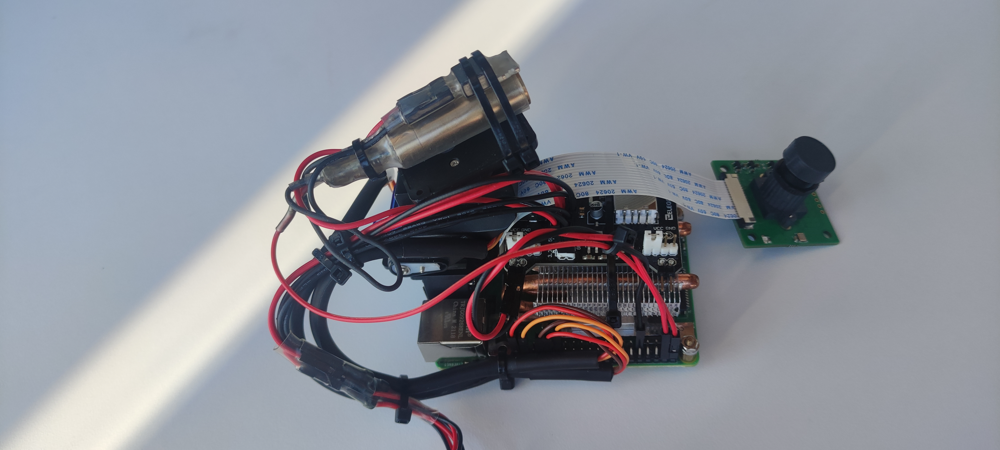
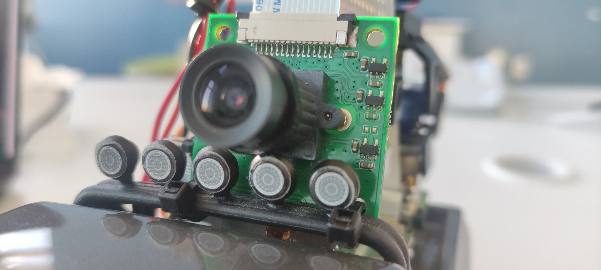
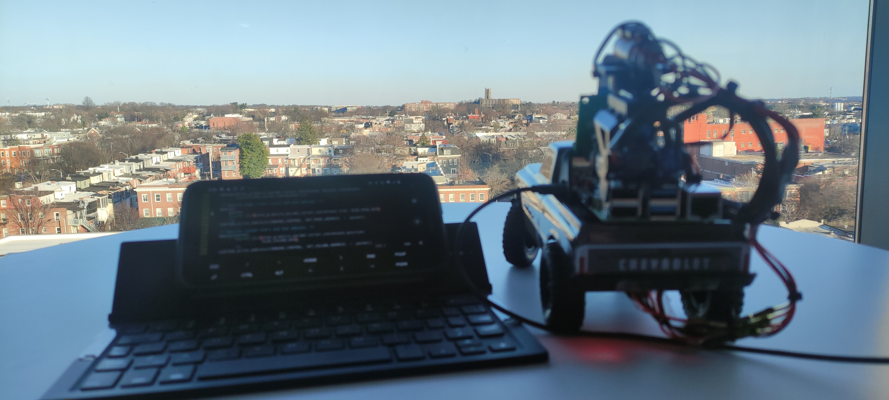
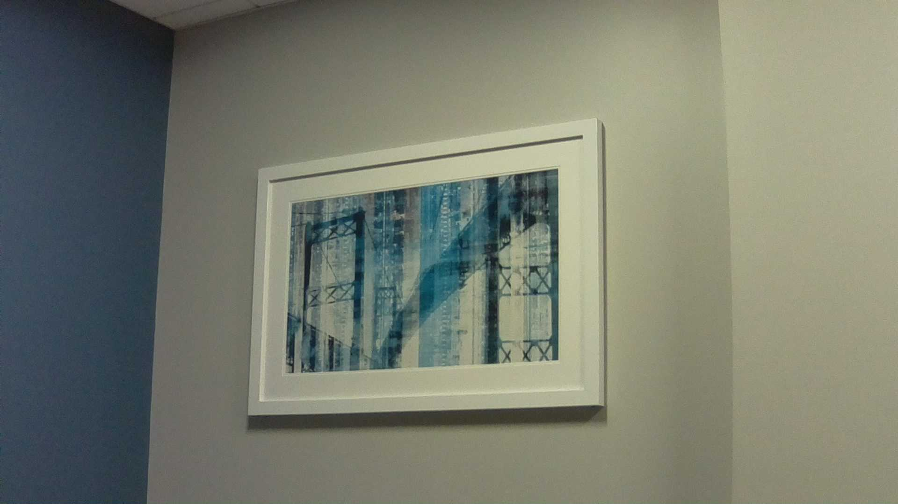

## Linux kernel camera driver for OV5647. 

    user_space/main.c interfaces V4L2 API through C library, the camera takes a photo from and save as a jpeg image.

    Tested on Linux raspberrypi 5.10.103-v7l+ #1529 SMP Tue Mar 8 12:24:00 GMT 2022 armv7l GNU/Linux (Raspberry Pi Buster.)

#### To take single picture with OV5647.

    $ cd user_space

    $ sudo modprobe ov5647

    $ make take-photo

#### Demo. Setup on the Raspberry Pi 4B+.

#### Demo. Image captured by OV5647 Camera module, Dec/27/2022, Baltimore, USA.

